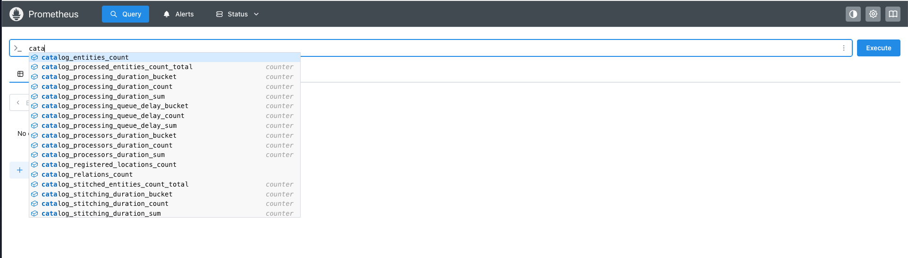
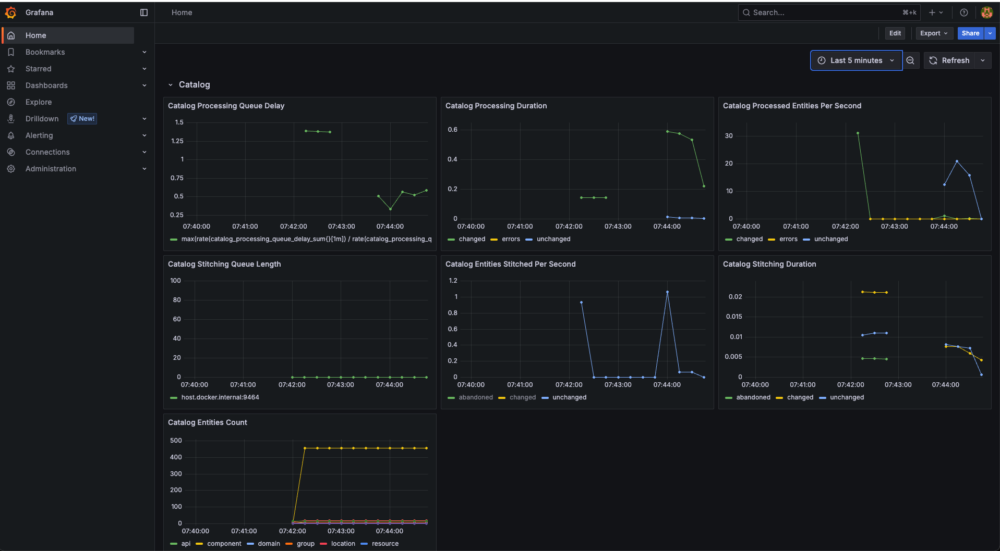
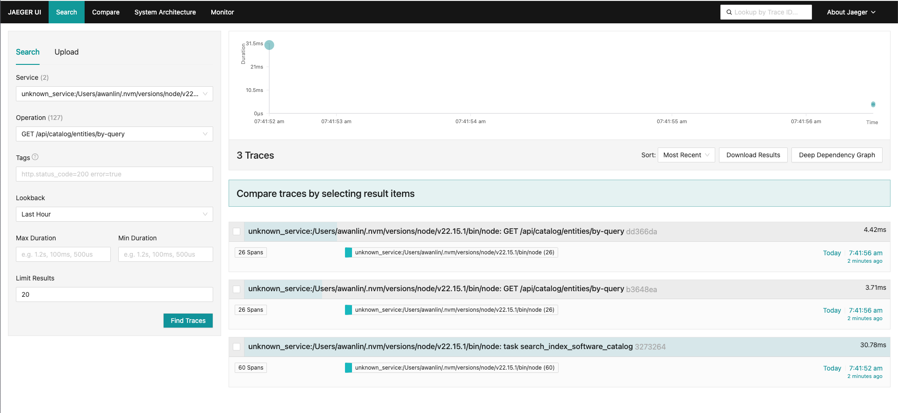

# [Backstage Demo](https://demo.backstage.io)

[](https://demo.backstage.io/catalog/default/component/backstage-demo) [](https://demo.backstage.io/catalog/default/component/backstage-demo/docs)

This repository is the source code for the demo [Backstage](https://backstage.io/) instance deployed to [demo.backstage.io](https://demo.backstage.io).

Instructions for building your own Backstage instance can be found at the [Getting Started](https://backstage.io/docs/getting-started/) portion of the docs.

## Reference Project

The spirit of this demo and repository is to showcase Backstage as closely as possible to what you would get from running `npx @backstage/create-app@latest` to create a new Backstage instance. There have been some additional changes beyond that starting point to help showcase some of Backstage's features more clearly. It also acts as a reference project for how to best keep it up to date and to show a working example of recent architecture patterns like the [new backend system](https://backstage.io/docs/backend-system/).

## Core Features

Here are the core features that come with Backstage and links to examples in the demo.

- [Software Catalog](https://demo.backstage.io/catalog)
- [Software Templates](https://demo.backstage.io/create)
- [Search](https://demo.backstage.io/search)
- [TechDocs](https://demo.backstage.io/docs)
- [Kubernetes plugin](https://demo.backstage.io/catalog/default/component/dice-roller)

### Catalog Ingestion

The Demo site Catalog is populated via a few methods. We ingest [some entities](https://github.com/backstage/backstage/blob/master/packages/catalog-model/examples) using [static configuration](https://github.com/backstage/demo/blob/97167e53786c158499a53c13b1c1a9592b61161d/app-config.yaml#L74).

We also ingest entities from the [Backstage & Community Plugins repos](https://github.com/backstage/demo/blob/97167e53786c158499a53c13b1c1a9592b61161d/app-config.yaml#L117) using the [GitHub Entity provider](https://backstage.io/docs/integrations/github/discovery). We use the events support for this provider to handle updates and also run it on a daily schedule as a reconciliation backup for any events that might have been dropped for various reasons - network issues, downstream outages, etc. A [GitHub WebHook](https://docs.github.com/en/webhooks/about-webhooks) has been added to the respective repos as part of this setup.

The flow of events happens as follows:

1. The GitHub WebHook fires an event to `https://demo.backstage.io/api/events/http/github`
2. The event is initially captured by the `@backstage/plugin-events-backend` based on [the `events.http.topics` configuration](https://github.com/backstage/demo/blob/97167e53786c158499a53c13b1c1a9592b61161d/app-config.yaml#L195).
3. Then the event is validated by `@backstage/plugin-events-backend-module-github` to further classify the topic with a subtopic and republishes the event.
4. The event with the updated topic then gets [picked up by `@backstage/plugin-catalog-backend-module-github`](https://github.com/backstage/backstage/blob/5cc0ca32e1a2f62420d3bccf209f7d428e8765d9/plugins/catalog-backend-module-github/src/providers/GithubEntityProvider.ts#L169-L173), which then [updates the entity/entities](https://github.com/backstage/backstage/blob/5cc0ca32e1a2f62420d3bccf209f7d428e8765d9/plugins/catalog-backend-module-github/src/providers/GithubEntityProvider.ts#L325).

## Additional Plugins

The following plugins have been added to help better illustrate Backstage features and to highlight the ability to add plugins.

- Badges: See the badges at the top of this `README`.
- [Cost Insights](https://demo.backstage.io/cost-insights)
- [Explore](https://demo.backstage.io/explore)
- [GitHub Actions](https://demo.backstage.io/catalog/default/component/backstage-demo/ci-cd)
- [GraphiQL](https://demo.backstage.io/graphiql)
- [Home](https://demo.backstage.io/home)
- [Tech Radar](https://demo.backstage.io/tech-radar)
- [To Do](https://demo.backstage.io/catalog/default/component/backstage-demo/todos)

### Alpha features

The following plugins are considered alpha and still under heavy development. They have been added to the Demo site to showcase them.

- [Notifications](https://demo.backstage.io/notifications)

## New Frontend System

The Demo site uses the default Legacy Frontend System as of 2025-05-19, as the New Frontend System is still in Alpha. For those looking for a working example of a migrated "app", we have added an `app-migrated` to showcase this. You can see the code for this in `/packages/app-migrated` and you can run this version locally by running: `yarn start:app-migrated`.

The `app-migrated` example is in a state where the ["Switching out `createApp`"](https://backstage.io/docs/frontend-system/building-apps/migrating/#switching-out-createapp) and the ["Migrating `createApp` Options"](https://backstage.io/docs/frontend-system/building-apps/migrating/#migrating-createapp-options) steps of the [Migrating Apps](https://backstage.io/docs/frontend-system/building-apps/migrating/) guide have been completed.

## Code Customization

We have made some code customizations as well. The following sections go into detail about them.

### Custom Theme

We have created a custom theme called `Aperture` to help showcase what some of the possibilities are that a custom theme can allow and to have a working example.

> Note: This theme is just an example and not intended to be copied as is.

To view this theme in the Demo:

1. Go to the [Settings area](https://demo.backstage.io/settings)
2. In the Appearance card for the Theme, click on "APERTURE"
3. The theme will automatically change; now you can explore the Demo to see how this theme looks.

The Aperture custom theme code can be found in the [`aperture.ts`](https://github.com/backstage/demo/blob/master/packages/app/src/theme/aperture.ts) file.

More details on creating a custom theme can be found in the [Creating a Custom Theme](https://backstage.io/docs/getting-started/app-custom-theme#creating-a-custom-theme) documentation.

### Home Plugin

Beyond the installation of the Home plugin, to get the most out of it you need to set up the initial code for it.

You can find the code in the [`HomePage.tsx`](https://github.com/backstage/demo/blob/master/packages/app/src/components/home/HomePage.tsx) file.

We have also set up the more advanced feature of the Home plugin that allows you to customize it more easily. The code for that is in [`CustomizableHomePage.tsx`](https://github.com/backstage/demo/blob/master/packages/app/src/components/home/CustomizableHomePage.tsx).

To see the more advanced Home in the Demo site you will need to do the following:

1. Go to the [feature flags area](https://demo.backstage.io/settings/feature-flags)
2. Next, click on the toggle labeled "customizable-home-page-preview"
3. Now refresh the page (feature flags are not reactive by design).
4. Navigate to the Home by clicking on the "Home" icon in the sidebar.
5. You should now see the more advanced Home. Clicking on the "EDIT" button is a good place to start playing around with the features.

More details on the Home plugin can be found in the [Backstage homepage - Setup and Customization](https://backstage.io/docs/getting-started/homepage) documentation.

### Search

The Search plugin has been expanded to include results from the Explore plugin's Tools list. This has been done in two places:

1. Frontend changes are in the [`SearchPage.tsx`](https://github.com/backstage/demo/blob/master/packages/app/src/components/search/SearchPage.tsx) file.
2. Backend changes are here: [`index.ts`](https://github.com/backstage/demo/blob/master/packages/backend/src/index.ts#L27) file.

> Note: Currently Search is set up on the frontend to include results from TechDocs but it is disabled in the backend due to a [bug that happens with an unusual setup](https://github.com/backstage/backstage/issues/23047) like the Demo site.

More information on adjusting search can be found in the [Customizing Search](https://backstage.io/docs/features/search/getting-started#customizing-search) documentation.

### OpenTelemetry

We've set up the Demo to expose the OpenTelemetry metrics and traces following the [Setup OpenTelemetry tutorial](https://backstage.io/docs/tutorials/setup-opentelemetry). These metrics and traces are only available when you run the project locally. To give you a full picture of what this looks like we have a basic observability stack setup using Prometheus Grafana to showcase the metrics and Jaeger to showcase the traces. Here's how you can launch this:

1. Clone this repo
2. Run `yarn install`
3. In one terminal tab run `yarn start:otel-prerequisites`
4. Then in a new terminal tab, different from the one in the above step, run `yarn start`
5. From here you can open the following links:
   - Prometheus: <http://localhost:9090>
   - Grafana: <http://localhost:3001> (default user name and password is admin; this is purely for demo usage and not a recommended pattern to follow)
   - Jaeger: <http://localhost:16686>

You should be getting metrics pretty quickly. Feel free to click around the local Backstage instance to generate more. You'll need to run the Demo Software Template to see any of the Scaffolder-related metrics.

We've included some basic examples in the showcase Grafana dashboard if you are looking for how you might use these metrics.

Prometheus example:



Grafana example:



Jaeger example:



## Upgrading

This Demo site is kept in sync with the weekly `next` release line as defined in the [Release Lines](https://backstage.io/docs/overview/versioning-policy#release-lines) documentation. Upgrading the Demo site has been automated so that a Pull Request with the latest changes is created the day after the weekly `next` release is published. This allows us to easily stay up to date!

The automation is done using a GitHub workflow but the concepts and most of its parts could easily be transferred to other CI/CD systems like Azure DevOps Pipelines, CircleCI, etc. The parts of this workflow can be found here:

- [Core workflow](https://github.com/backstage/demo/blob/master/.github/workflows/version-bump.yml)
- [Related scripts](https://github.com/backstage/demo/blob/master/scripts/set-release-name.js)

## Dependency Updates

As Backstage uses packages for its various dependencies, these will need to be kept up to date. We use [Renovate](https://github.com/renovatebot/renovate?tab=readme-ov-file#why-use-renovate) as it is incredibly helpful in keeping dependency versions up to date. Renovate will create Pull Requests for the various dependencies and all we need to do is review and merge them!

You can see our Renovate configuration in the [`renovate.json`](https://github.com/backstage/demo/blob/master/renovate.json) file and example [Pull Requests here](https://github.com/backstage/demo/pulls?q=is%3Aopen+is%3Apr+label%3Adependencies).

> Note: you may not see any Pull Request as we very much like to stay on top of them; clicking on the "Closed" option will let you see examples that have been merged in the past.

To learn how to get started with Renovate we recommend reading the [Installing and onboarding Renovate into repositories](https://docs.renovatebot.com/getting-started/installing-onboarding/) documentation.

## Working With This Repo

The following sections are to help those working with this repo to keep it maintained.

### Local Docker

The Dockerfile in this repo can be built locally using the following command:

```bash
docker image build .  -t demo --build-arg ENVIRONMENT_CONFIG=local
```

This will build the image with your `app-config.local.yaml` included this allows you to include any config you might want to have in place for local testing.

Using `--progress=plain --no-cache` can also be helpful with testing changes.

You can then run it with this command:

```bash
docker run -it -p 7007:7007 demo
```
