# Mermaid on Github Examples

These were taken from this gist: <https://gist.github.com/ChristopherA/bffddfdf7b1502215e44cec9fb766dfd>

All of these diagrams are dynamically rendered during html display by Github, the images generated from text inside the Github-Flavored Markdown. None are static images. Mermaid support was released for Github on [2022-02-14](https://github.blog/2022-02-14-include-diagrams-markdown-files-mermaid/)

Pros & Cons:

- Pro: You don't need to care about the layout.
- Con: You cannot control the layout.

Notes:

- Not all the features of Mermaid (in particular symbols `B-->C[fa:fa-ban forbidden]`, hyperlink and tooltips) are supported by Github.
- A number of other Markdown features don't work within Mermaid labels but don't break it: `:grinning:`=😀, `*italic*`=_italic_, mathjax `n<sup>2</sup>`=n<sup>2</sup>.
- Many characters, in particular emoji `😀` & some extended ASCII `†¶` (but oddly, not extended ASCII `²`), break Mermaid with errors.
- Some embed GitHub gists and pages into other pages, and this doesn't seem to work (yet).

Docs & Tools:

- [Mermaid Docs](https://mermaid-js.github.io/mermaid/)
- [Mermaid Live Editor](https://mermaid.live/edit) (Also supports copy from Github gists and saving to `.svg` `.png`)
- [Mermaid Cheat Sheet](https://jojozhuang.github.io/tutorial/mermaid-cheat-sheet/)

Some real-world examples of Mermaid Diagrams in Github:

- [Pattern: AppDelegate -> Router -> MVP/C](https://gist.github.com/vtsoup/f1f79d19d6f8e58396bde8847c09a62e)
- [Navigation(_italian_)](https://gist.github.com/balanza/39bd68f3978ae7dd6a486321b2251ce7)

## [Graph (aka Flowchart)](https://mermaid-js.github.io/mermaid/#/flowchart)

### Simple Example as Markdown

````markdown
    ```mermaid
    graph LR;
    A-->B;
    A-->C;
    B-->D;
    C-->D;
    ```
````

````markdown
    ```mermaid
    flowchart LR
        a[Chapter 1] --> b[Chapter 2] --> c[Chapter 3]
        c-->d[Using Ledger]
        c-->e[Using Trezor]
        d-->f[Chapter 4]
        e-->f
    ```
````

### Simple Left-Right Graph


### Simple Graph to Mark Chapters


### Simple Top-Down Graph


### Dependency Sets


### Binary Tree


### Graph Shape & Link Variants


### Basic Flowchart


### More complex Flowchart "Coffee Machine Not Working?"


### Flowchart with Hyperlinks

Notes:

- Hyperlinks in labels while using Github's Mermaid are not by default visually different.
- Tooltips, callbacks and other [interaction features](https://mermaid-js.github.io/mermaid/#/flowchart?id=interaction) of Mermaid do not seem to function Github's Mermaid.
- Relative and internal hyperlinks do not seem to function properly in Github's Mermaid, they must be full links.
- To be safe, you should use quote around any label text that have symbols in them, in particular parenthesis & various brackets `A-->B["This is a (test).]"` and any non-ASCII characters (use HTML Entities instead such as `&dagger;` is † `&#128279;` is 🔗.
- TBD: Create a better example and document how to make hyperlinks work better within the limits of what GitHub's Mermaid supports, and come up some work-arounds for best practices (maybe some Mermaid styling trick like underlines. (see https://github.com/mermaid-js/mermaid/issues/2870 ).


### More Complex Example


### Subgraph


### Themed Subgraph


### Flowchart with Styling

```mermaid
graph TB
    sq[Square shape] --> ci((Circle shape))

    subgraph A
        od>Odd shape]-- Two line<br/>edge comment --> ro
        di{Diamond with <br/> line break} -.-> ro(Rounded<br>square<br>shape)
        di==>ro2(Rounded square shape)
    end

    %% Notice that no text in shape are added here instead that is appended further down
    e --> od3>Really long text with linebreak<br>in an Odd shape]

    %% Comments after double percent signs
    e((Inner / circle<br>and some odd <br>special characters)) --> f(,.?!+-*ز)

    cyr[Cyrillic]-->cyr2((Circle shape Начало));

     classDef green fill:#9f6,stroke:#333,stroke-width:2px;
     classDef orange fill:#f96,stroke:#333,stroke-width:4px;
     class sq,e green
     class di orange
```



### Decision Tree

(from: <https://bionicteaching.com/gravity-forms-mermaid-decision-flowcharts/> )


### Styled Links

(from [StackOverflow](https://stackoverflow.com/questions/68452674/style-multiple-links-mermaid-js))


## [Sequence Diagram](https://mermaid-js.github.io/mermaid/#/sequenceDiagram)


### Three-way Handshake (Sequence Diagram)


### How mermaid is generated by Github


### Sequence with Loop & Notes


## [Class Diagram](https://mermaid-js.github.io/mermaid/#/classDiagram)

```mermaid
classDiagram
    Animal <|-- Duck
    Animal <|-- Fish
    Animal <|-- Zebra
    Animal : +int age
    Animal : +String gender
    Animal: +isMammal()
    Animal: +mate()
    class Duck{
      +String beakColor
      +swim()
      +quack()
    }
    class Fish{
      -int sizeInFeet
      -canEat()
    }
    class Zebra{
      +bool is_wild
      +run()
    }
```

## [State Diagram](https://mermaid-js.github.io/mermaid/#/stateDiagram)

### Simple State Diagram

```mermaid
stateDiagram-v2
    [*] --> Still
    Still --> [*]
    Still --> Moving
    Moving --> Still
    Moving --> Crash
    Crash --> [*]
```

### More Complex

```mermaid
stateDiagram-v2
  [*] --> Unwritten

  Unwritten --> Open: Open
  Unwritten --> Void: Void

  Open --> Void: Void
  Open --> Cancelled: Cancel
  Open --> Closed: Close
  Open --> Open: Update

  Closed --> Open: Open
```

```mermaid
stateDiagram-v2
    [*] --> First
    state First {
        [*] --> second
        second --> [*]
    }
```

```mermaid
 stateDiagram-v2
    state fork_state <<fork>>
      [*] --> fork_state
      fork_state --> State2
      fork_state --> State3

      state join_state <<join>>
      State2 --> join_state
      State3 --> join_state
      join_state --> State4
      State4 --> [*]
```

```mermaid
stateDiagram-v2
        State1: The state with a note
        note right of State1
            Important information! You can write
            notes.
        end note
        State1 --> State2
        note left of State2 : This is the note to the left.
```

## Shipment Status

```mermaid
stateDiagram-v2
  direction LR
  [*] --> Initialed
  Initialed --> SellerSent
  SellerSent --> Transported
  Transported --> BuyerPicked
  BuyerPicked --> Delivered
  Delivered --> [*]

  BuyerPicked --> BuyerSent
  BuyerSent --> ReturnTransported
  ReturnTransported --> SellerPicked
  SellerPicked --> [*]

  Transported --> ReturnTransported: buyer doesn'y pick up the item after 1 week
```

## [Gantt Diagram](https://mermaid-js.github.io/mermaid/#/gantt)

```mermaid
gantt
 title Example Gantt diagram
    dateFormat  YYYY-MM-DD
    section Team 1
    Research & requirements :done, a1, 2020-03-08, 2020-04-10
    Review & documentation : after a1, 20d
    section Team 2
    Implementation      :crit, active, 2020-03-25  , 20d
    Testing      :crit, 20d
```

### Another GANTT Diagram

```mermaid
gantt
dateFormat  YYYY-MM-DD
title Adding GANTT diagram to mermaid
excludes weekdays 2014-01-10

section A section
Completed task            :done,    des1, 2014-01-06,2014-01-08
Active task               :active,  des2, 2014-01-09, 3d
Future task               :         des3, after des2, 5d
Future task2               :         des4, after des3, 5d
```

## [Entity Relationship Diagram](https://mermaid-js.github.io/mermaid/#/entityRelationshipDiagram)

```mermaid
erDiagram
    CUSTOMER ||--o{ ORDER : places
    CUSTOMER {
        string name
        string custNumber
        string sector
    }
    ORDER ||--|{ LINE-ITEM : contains
    ORDER {
        int orderNumber
        string deliveryAddress
    }
    LINE-ITEM {
        string productCode
        int quantity
        float pricePerUnit
    }
```

```mermaid
erDiagram
          CUSTOMER }|..|{ DELIVERY-ADDRESS : has
          CUSTOMER ||--o{ ORDER : places
          CUSTOMER ||--o{ INVOICE : "liable for"
          DELIVERY-ADDRESS ||--o{ ORDER : receives
          INVOICE ||--|{ ORDER : covers
          ORDER ||--|{ ORDER-ITEM : includes
          PRODUCT-CATEGORY ||--|{ PRODUCT : contains
          PRODUCT ||--o{ ORDER-ITEM : "ordered in"
```

## [User Journey Diagram](https://mermaid-js.github.io/mermaid/#/user-journey)

```mermaid
  journey
    title My working day
    section Go to work
      Make tea: 5: Me
      Go upstairs: 3: Me
      Do work: 1: Me, Cat
    section Go home
      Go downstairs: 5: Me
      Sit down: 3: Me
```

## [Pie Chart Diagram](https://mermaid-js.github.io/mermaid/#/pie)

```mermaid
pie title Pets adopted by volunteers
    "Dogs" : 386
    "Cats" : 85
    "Rats" : 15
```

## [Requirement diagram](https://mermaid-js.github.io/mermaid/#/requirementDiagram)

```mermaid
requirementDiagram

    requirement test_req {
    id: 1
    text: the test text.
    risk: high
    verifymethod: test
    }

    element test_entity {
    type: simulation
    }

    test_entity - satisfies -> test_req
```

## GitGraph

This does not seem to be documented, see [#2011](https://github.com/mermaid-js/mermaid/issues/2011).

```mermaid
gitGraph
    commit
    branch newbranch
    checkout newbranch
    commit
    commit
    checkout main
    commit
    commit
    merge newbranch
```
