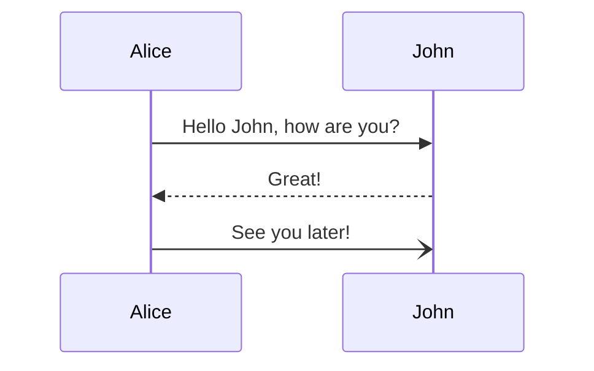

# Mermaid

## Overview

This page shows how you can use [Mermaid](https://mermaid.js.org/intro/) in TechDocs.

## Explanation

To be able to use Mermaid diagrams with TechDocs you'll need to follow this guide: [How to add Mermaid support in TechDocs](https://backstage.io/docs/features/techdocs/how-to-guides#how-to-add-mermaid-support-in-techdocs).

## Example

Here is an example:



## Markdown

Here is the Markdown:

```markdown
mermaid
sequenceDiagram
Alice->>John: Hello John, how are you?
John-->>Alice: Great!
Alice-)John: See you later!
```

> Note: in order to prevent Mermaid from rendering the diagram above the backticks (\`) have been removed. You'll want to add 3 backticks on line 1 before `mermaid` and then another 3 backticks on a new line below line 5.
