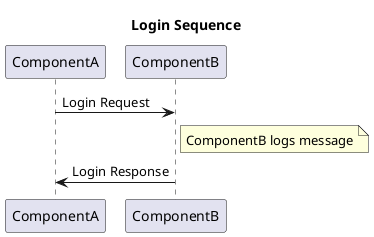

# PlantUML

## Overview

This page shows how you can use [PlantUML](https://plantuml.com/) in TechDocs.

## Explanation

The [`techdocs-core`](https://github.com/backstage/mkdocs-techdocs-core) MkDocs plugin includes the [`plantuml-markdown`](https://github.com/mikitex70/plantuml-markdown) plugin which allows you to add PlantUML diagrams in your Markdown easily.

## Example

Here is an example:



## Markdown

Here is the Markdown:

```markdown
plantuml
@startuml
title Login Sequence
    ComponentA->ComponentB: Login Request
    note right of ComponentB: ComponentB logs message
    ComponentB->ComponentA: Login Response
@enduml
```

>Note: in order to prevent PlantUML from rendering the diagram above the backticks (\`) have been removed. You'll want to add 3 backticks on line 1 before `plantuml` and then another 3 backticks on a new line below line 7.
